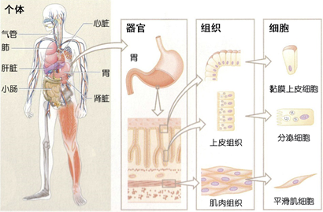
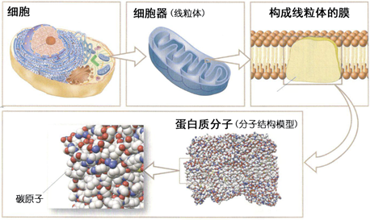
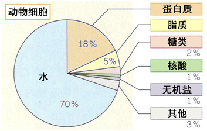

# 第1节 构成生物体的物质

生物由细胞组成，而细胞又是由性质各异的物质组成的。为了理解细胞如何组成个体，又是由怎样的物质构成的，本节我们先来学习构成生物体的物质。

## 1 生物体的结构与层次

### A 从细胞到个体

生物个体由**细胞**组成。人是多细胞生物，同样形状与功能的细胞形成**组织**[1](#_ftn1)，组织进而形成**器官**。这些组织和器官相互协调，构成**个体**维持生命活动（图1）。

例如，细胞的活动需要营养和氧气。小肠等构成的消化系统可以吸收营养，肺等构成的呼吸系统可以获取氧气，通过心脏、血管等构成的循环系统将它们运送到全身各细胞，从而支持细胞的活动。此外，为使各细胞稳定的活动，体内的还必须处在体液当中，肝脏和肾脏等可以将体液的状态保持在一定范围内。

图1 动物个体的结构与层次

[1](#_ftnref1) 动物的组织包括覆盖于身体表面的**上皮组织**、构成肌肉的**肌肉组织**、连接不同组织并支持生物体的**结缔组织**、传递信息的**神经组织**。

### B 从细胞到分子

另一方面，观察构成生物体的细胞，可以发现线粒体、高尔基体等各种**细胞器**以及细胞核。许多细胞器都具有两层磷脂分子组成的膜。线粒体由内外两层膜组成，内膜上镶嵌有与呼吸相关的蛋白质分子[2](#_ftn2)，这些蛋白质促使ATP合成。

像这样，生物体的结构和功能，就可以逐步分解为器官、组织、细胞、细胞器、分子等层次（图1、图2）。

图2 细胞的层次

[2](#_ftnref2) 蛋白质是由多个氨基酸组成的，氨基酸是由碳（C）、氢（H）、氧（O）、氮（N）等**元素**组成的。

## 2 构成细胞的物质

对于大多数生物，构成细胞的物质都是相同的，其中含量最多的是**水**。除了水以外，还有蛋白质、脂质、糖类等**有机物**以及**无机盐**（图3）。

图3 构成细胞物质的比例